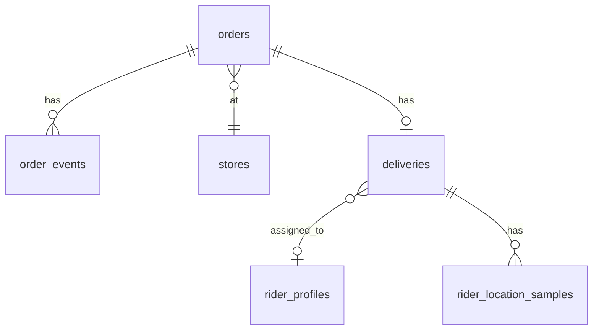

# LOOMY order tracking — starter schema sketch

Use as a default starting point; adjust enums and columns to the repo’s existing `users`, `stores`, and Stripe fields. This file is **design reference only**—generate real migrations in `supabase/migrations` during implementation.

---

## Enums

| Enum | Suggested values | Notes |
|------|------------------|--------|
| `order_status` | `pending_payment`, `placed`, `accepted`, `preparing`, `ready_for_pickup`, `picked_up`, `out_for_delivery`, `delivered`, `cancelled`, `refunded` | Map UI copy later; some teams split payment vs fulfillment—merge or split enums if needed. |
| `delivery_status` | `unassigned`, `assigned`, `rider_en_route_store`, `at_store`, `picked_up`, `en_route_customer`, `at_customer`, `completed`, `failed` | Optional if all state lives on `orders` only; useful when one order has a clear delivery leg. |
| `order_event_type` | `status_change`, `note`, `eta_update`, `location_sample`, `system` | Drives timeline rendering. |

---

## Tables (logical model)

### `stores` (assumed existing)

Reference only. Tracking needs `id`, geolocation for ETA, operating linkage to staff.

### `store_staff` (if not present)

Links `auth.users` to `stores` with role (`owner`, `manager`, `staff`). RLS for store-scoped reads/writes.

### `rider_profiles` (if not present)

Links `auth.users` to rider facts: `vehicle_type`, `is_active`, optional `current_lat`/`current_lng` **or** prefer separate position table (below).

### `orders`

| Column | Type | Notes |
|--------|------|--------|
| `id` | uuid PK | |
| `customer_id` | uuid FK → auth users / `profiles` | Who placed it. |
| `store_id` | uuid FK → stores | |
| `status` | `order_status` | Primary customer-facing state. |
| `stripe_payment_intent_id` | text nullable | If payment gates `accepted`. |
| `placed_at`, `accepted_at`, `delivered_at` | timestamptz nullable | Denormalized milestones for list views. |
| `delivery_address` | jsonb or structured columns | Snapshot at order time. |
| `customer_notes` | text nullable | |

**Indexes:** `(store_id, status, placed_at DESC)`, `(customer_id, placed_at DESC)`.

### `order_items` (assumed for commerce)

Omitted detail; tracking usually only needs existence for store prep.

### `order_events` (append-only timeline)

| Column | Type | Notes |
|--------|------|--------|
| `id` | uuid PK | |
| `order_id` | uuid FK → orders ON DELETE CASCADE | |
| `type` | `order_event_type` | |
| `from_status`, `to_status` | `order_status` nullable | When `type = status_change`. |
| `actor_user_id` | uuid nullable | Who caused it; null for system. |
| `payload` | jsonb default `{}` | ETA seconds, rider id, coarse location, etc. |
| `created_at` | timestamptz default now() | |

**Indexes:** `(order_id, created_at DESC)`. **Realtime:** subscribe by `order_id` filter for live timeline.

### `deliveries` (one active row per order in delivery)

| Column | Type | Notes |
|--------|------|--------|
| `id` | uuid PK | |
| `order_id` | uuid FK → orders UNIQUE (partial: where not completed/cancelled) **or** one row per order with terminal statuses | Enforces single active delivery leg. |
| `rider_id` | uuid FK → rider_profiles / users | Nullable until assigned. |
| `status` | `delivery_status` | Rider-centric leg. |
| `assigned_at`, `picked_up_at`, `completed_at` | timestamptz nullable | |

**Indexes:** `(rider_id, status)` for “my active run”; `(status)` for job pool queries (careful: use PostGIS or region bucketing later for scale).

### `rider_location_samples` (optional, throttled)

| Column | Type | Notes |
|--------|------|--------|
| `id` | bigserial or uuid | |
| `delivery_id` | uuid FK | Or `order_id` if no `deliveries`. |
| `rider_id` | uuid | |
| `lat`, `lng` | double precision | Consider `geography(Point)` later. |
| `recorded_at` | timestamptz | Server time on insert. |

**Policy:** insert only by owning rider; customer read via RLS join on their order’s delivery. **Retention:** partition or trim old rows; **Realtime** optional (high churn)—many products poll every N s or use channels with coarse updates.

---

## Relationships (Mermaid)

---

## RLS (intent sketch)

| Table | Customer | Store staff | Rider |
|-------|----------|-------------|--------|
| `orders` | CRUD own rows; read own | Read/update rows for their `store_id` | Read rows assigned to them via `deliveries` |
| `order_events` | Select for own orders | Select for store’s orders | Select for assigned delivery’s order |
| `deliveries` | Select for own order | Select for store’s orders | Update own assignment; insert N/A if server assigns |
| `rider_location_samples` | Select if linked to own order | Optional read for handoff | Insert own; select own |

Use **security definer** RPCs or Edge Functions for sensitive transitions (assign rider, cancel after pickup) if policies get unwieldy.

---

## Realtime channels (typical)

1. `orders`: row for `id` customer/store subscribed to—`status` and milestone columns.  
2. `order_events`: insert stream for timeline.  
3. `rider_location_samples`: optional; throttle writes to avoid Realtime noise.

---

## Stripe (tracking boundary)

Keep **payment state** in Stripe/webhook handlers; mirror only what the app needs (`pending_payment` → `placed`) on `orders`. Do not duplicate full Connect state in tracking tables unless product requires it.
